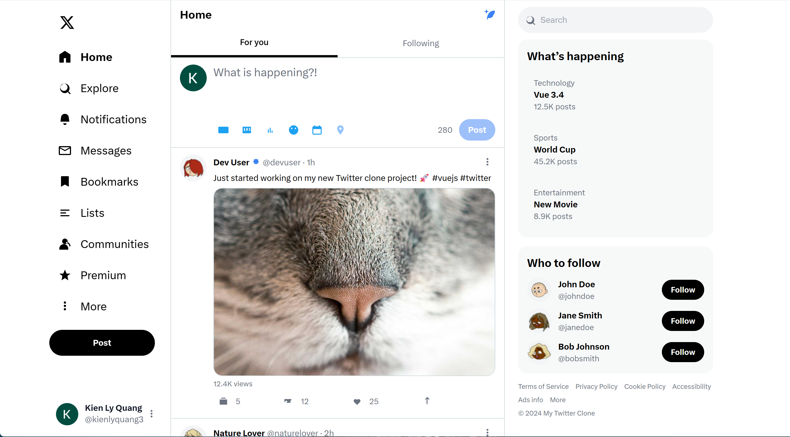

# My Twitter Clone

A full-stack Twitter clone built with Vue 3, Express.js, TypeScript, and modern web technologies.

## 在线演示

- 部署地址： https://coke-twitter.com/

## 📸 Screenshots




## 🚀 Features

### Core Features
- **User Authentication**: JWT-based authentication with refresh tokens
- **Tweet Management**: Create, read, update, delete tweets with character limits
- **Real-time Updates**: Live notifications and messaging with Socket.IO
- **Follow System**: Follow/unfollow users with real-time updates
- **Media Upload**: Support for images, videos, and GIFs
- **Search**: Advanced search for users, tweets, and trending topics
- **Notifications**: Real-time notifications for likes, follows, replies, and mentions
- **Direct Messaging**: Real-time private messaging between users
- **Responsive Design**: Mobile-first responsive UI with TailwindCSS

### Technical Features
- **TypeScript**: Full-stack TypeScript implementation
- **Prisma ORM**: Modern database ORM with type safety
- **Real-time Communication**: WebSocket support with Socket.IO
- **Caching**: Redis integration for performance optimization
- **File Upload**: Multer integration for media handling
- **Rate Limiting**: API rate limiting for security
- **CORS**: Proper CORS configuration for cross-origin requests

## 🛠 Technology Stack

### Frontend
- **Vue 3** with Composition API
- **TypeScript** for type safety
- **TailwindCSS** for styling
- **Pinia** for state management
- **Vue Router** for routing
- **Axios** for HTTP requests
- **Socket.IO Client** for real-time features
- **Headless UI** for accessible components
- **Heroicons** for icons

### Backend
- **Express.js** with TypeScript
- **Prisma ORM** with MySQL
- **JWT** for authentication
- **Socket.IO** for real-time features
- **Bcrypt** for password hashing
- **Multer** for file uploads
- **Redis** for caching
- **Rate Limiting** for API security

### Database
- **MySQL 8.0** as primary database
- **Redis** for caching and sessions
- **Prisma Migrations** for database schema management

### DevOps
- **Nginx** as reverse proxy
- **ESLint** + **Prettier** for code quality
- **Git Hooks** for pre-commit checks

## 📁 Project Structure

```
my-twitter/
├── frontend/                 # Vue 3 frontend application
│   ├── src/
│   │   ├── components/      # Reusable Vue components
│   │   ├── views/          # Page components
│   │   ├── stores/         # Pinia stores
│   │   ├── router/         # Vue Router configuration
│   │   ├── types/          # TypeScript type definitions
│   │   └── utils/          # Utility functions
│   ├── public/             # Static assets
│   └── package.json
├── backend/                 # Express.js backend application
│   ├── src/
│   │   ├── routes/         # API route definitions
│   │   ├── middleware/     # Express middleware
│   │   ├── services/       # Business logic services
│   │   ├── types/          # TypeScript type definitions
│   │   └── config/         # Configuration files
│   ├── prisma/             # Database schema and migrations
│   └── package.json
├── docker/                 # Docker configuration files
│   └── nginx.conf          # Nginx configuration
├── test/                   # Test files and deployment keys
└── docs/                   # Documentation
```

## 🚀 Getting Started

### Prerequisites
- Node.js 18+
- MySQL 8.0+
- Redis 7+

### Installation

1. **Clone the repository**
   ```bash
   git clone https://github.com/cokepoppy/my-twitter.git
   cd my-twitter
   ```

2. **Set up environment variables**
   ```bash
   # Backend
   cp backend/.env.example backend/.env

   # Frontend
   cp frontend/.env.example frontend/.env
   ```

3. **Install dependencies**
   ```bash
   # Frontend
   cd frontend
   npm install

   # Backend
   cd ../backend
   npm install
   ```

4. **Set up the database**
   ```bash
   # Generate Prisma client
   npx prisma generate

   # Push database schema
   npx prisma db push
   ```

5. **Start the development servers**
   ```bash
   # Frontend (terminal 1)
   cd frontend
   npm run dev

   # Backend (terminal 2)
   cd backend
   npm run dev
   ```

### Development URLs
- Frontend: http://localhost:3000
- Backend API: http://localhost:8000
- API Documentation: http://localhost:8000/api

## 📖 API Documentation

### Authentication Endpoints
- `POST /api/auth/register` - Register new user
- `POST /api/auth/login` - User login
- `GET /api/auth/me` - Get current user
- `POST /api/auth/refresh` - Refresh JWT token
- `POST /api/auth/logout` - User logout

### User Endpoints
- `GET /api/users/profile/:username` - Get user profile
- `PUT /api/users/profile` - Update user profile
- `PUT /api/users/password` - Change password
- `GET /api/users/:username/followers` - Get user's followers
- `GET /api/users/:username/following` - Get user's following
- `GET /api/users/search` - Search users

### Tweet Endpoints
- `POST /api/tweets` - Create tweet
- `GET /api/tweets/:id` - Get tweet by ID
- `DELETE /api/tweets/:id` - Delete tweet
- `POST /api/tweets/:id/like` - Like/unlike tweet
- `POST /api/tweets/:id/retweet` - Retweet/unretweet
- `GET /api/tweets/timeline` - Get user timeline

### Follow Endpoints
- `POST /api/follows/:username/follow` - Follow/unfollow user
- `GET /api/follows/:username/followers` - Get user's followers
- `GET /api/follows/:username/following` - Get user's following
- `GET /api/follows/requests` - List incoming follow requests (for private accounts)
- `GET /api/follows/requests/sent` - List outgoing follow requests
- `POST /api/follows/requests/:id/approve` - Approve a follow request
- `POST /api/follows/requests/:id/deny` - Deny a follow request
- `DELETE /api/follows/:username/remove` - Remove a follower

### Notification Endpoints
- `GET /api/notifications` - Get user notifications
- `PUT /api/notifications/:id/read` - Mark notification as read
- `DELETE /api/notifications/:id` - Delete notification

### Message Endpoints
- `GET /api/messages/conversations` - Get user conversations
- `GET /api/messages/:username` - Get messages with user
- `POST /api/messages/:username` - Send message
- `PUT /api/messages/:username/read` - Mark messages as read

### Search Endpoints
- `GET /api/search` - Global search
- `GET /api/search/trending` - Get trending topics
- `GET /api/search/suggestions` - Get search suggestions

## ⚙️ Environment Variables

### Backend Environment (.env)
```env
# Database
DATABASE_URL="mysql://root@localhost:3306/twitter"

# JWT
JWT_SECRET="your-secret-key-change-this-in-production"

# Redis
REDIS_URL="redis://localhost:6379"

# Server
PORT=8000
NODE_ENV=development

# Frontend
FRONTEND_URL="http://localhost:3000"
```

### Frontend Environment (.env)
```env
VITE_API_URL=http://localhost:8000
VITE_SOCKET_URL=http://localhost:8000
```

## 🧪 Testing

### Running Tests
```bash
# Frontend tests
cd frontend
npm run test

# Backend tests
cd backend
npm run test
```

## 🚀 Deployment

### Production Build
```bash
# Frontend
cd frontend
npm run build

# Backend
cd backend
npm run build
```

### Manual Deployment
1. Set up production database
2. Configure environment variables
3. Build frontend and backend
4. Set up reverse proxy (nginx)
5. Configure SSL certificates
6. Deploy to server

### Cloud Deployment
The application is currently deployed on:
- **Server**: Alibaba Cloud ECS
- **URL**: http://120.79.174.9/
- **API**: http://120.79.174.9/api/

## 🤝 Contributing

1. Fork the repository
2. Create a feature branch (`git checkout -b feature/amazing-feature`)
3. Commit your changes (`git commit -m 'Add some amazing feature'`)
4. Push to the branch (`git push origin feature/amazing-feature`)
5. Open a Pull Request

### Development Guidelines
- Follow the existing code style
- Write tests for new features
- Update documentation as needed
- Use TypeScript for type safety
- Follow Vue 3 Composition API patterns
- Use Prisma for database operations

## 📄 License

This project is licensed under the MIT License - see the [LICENSE](LICENSE) file for details.

## 🙏 Acknowledgments

- Twitter for the original design inspiration
- Vue.js team for the amazing framework
- Prisma team for the modern ORM
- TailwindCSS team for the utility-first CSS framework

## 🆘 Support

If you have any questions or issues, please:
- Open an issue on GitHub
- Check the documentation in the `docs/` folder
- Review the API documentation above

---

**Built with ❤️ using modern web technologies**
